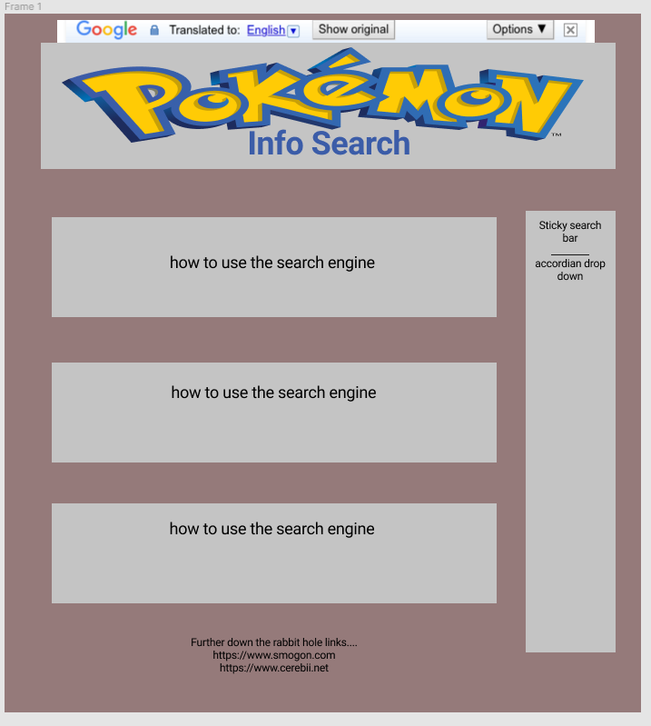
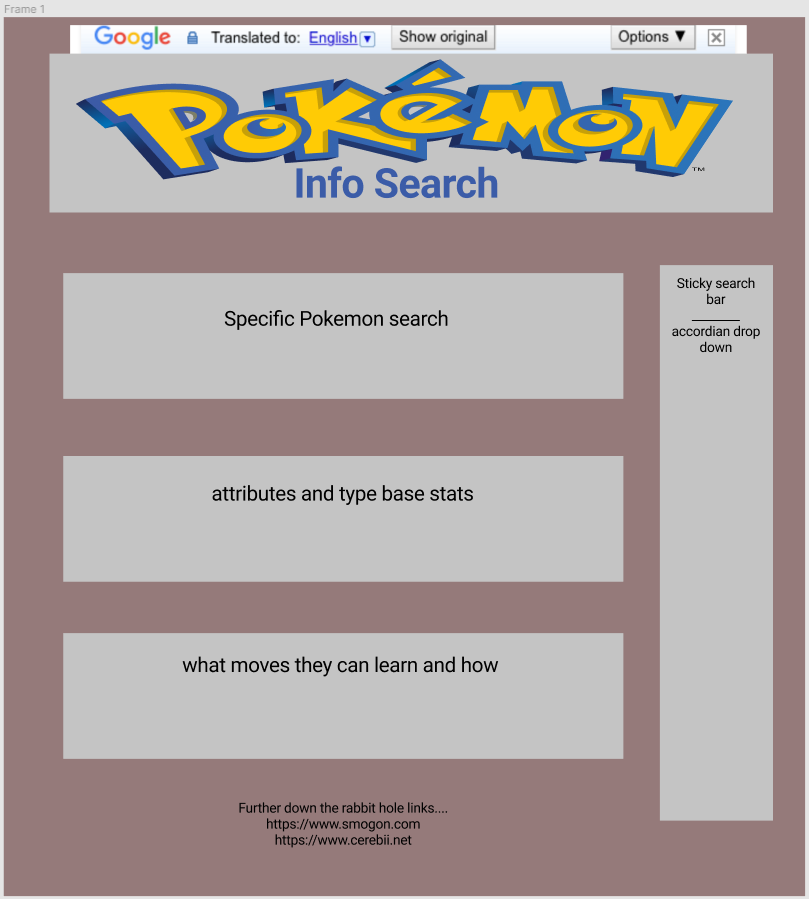
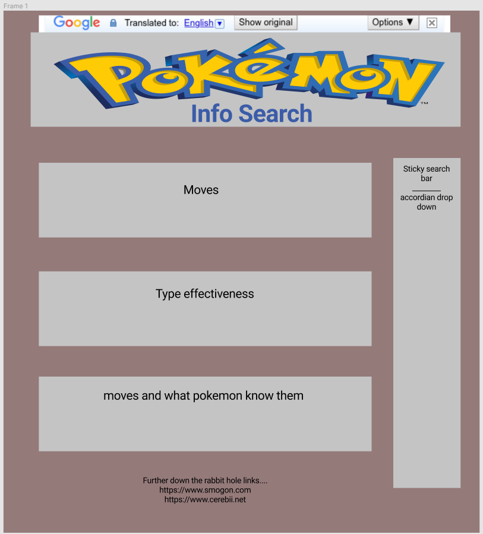

# pokemonTeamProject
The idea started with Kalyn Reid pitching the idea about a pokemon website where a user can type in a pokemon in a searchbar and the relevant information will be displayed to them.
The first group meeting we developed the MVP for the website as well as some ambitious additions we wanted to do if we had the time and resources to do so.

These were our goals we achieved on our first meeting:
  1. MVP (Minimum Viable Product):
    a. Being able to type in a Pokémon in a search function, retrieve data about that pokemon using the Pokémon API, then return and display infomation about that Pokémon to the          user
  2. Agree on an ambitious number of add-ons:
    a. Pokemon evolutions
    b. Different game appearances
    c. Pokémon moves
    d. Enable search based on move
    e. Enable different search functions based on generation of Pokémon game
    f. Display ranking of Pokémon based on competitve ranking (using smogon)
    g. Incorporate Pokémon sprites in website
  3. Investigate APIs and make sure they have the data to meet MVP needs.
    a. Pokémon API (very thorough, encapsulates the majority of the project)
    b. Google search API (for website search bar)
    c. Translation API (to translation to different languages)
    
Second meeting we created a mockup of the website using Figma:
  The landing page:
    
  
  The Pokémon page:
    
  
  The Pokémon move page:
    
    
